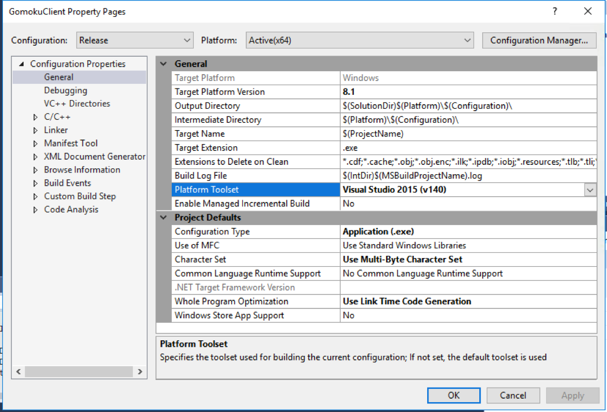

## Appendix B - Compiling the Source Binary

Compiling the binaries used in this example.

This lab has 3 different binaries used throughout. 1 Game client, and 2 game server binaries are used. For your convenience, each of them are precompiled and supplied within the starting package, however if you want to compile the binary yourself, here’s the simple instruction on compiling.

You need to have Visual Studio 2015 Community Edition installed. If you can reconfigure VS 2017 to match that of 2015, you might try, however due to the NuGet package dependency, it is recommended to use VS 2015 edition instead.

Also you will want to use the platform toolset version Visual Studio 2015 (v140).
 

The each of the project files, GomokuServer.sln, GomokuMatchMaker.sln, GomokuClient.sln are prepared within the project directory.

As for NuGet, please refer to this link for detailed information on how to update the package maneger on Visual Studio 2015.