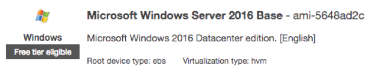
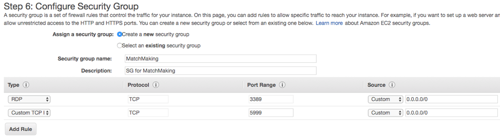
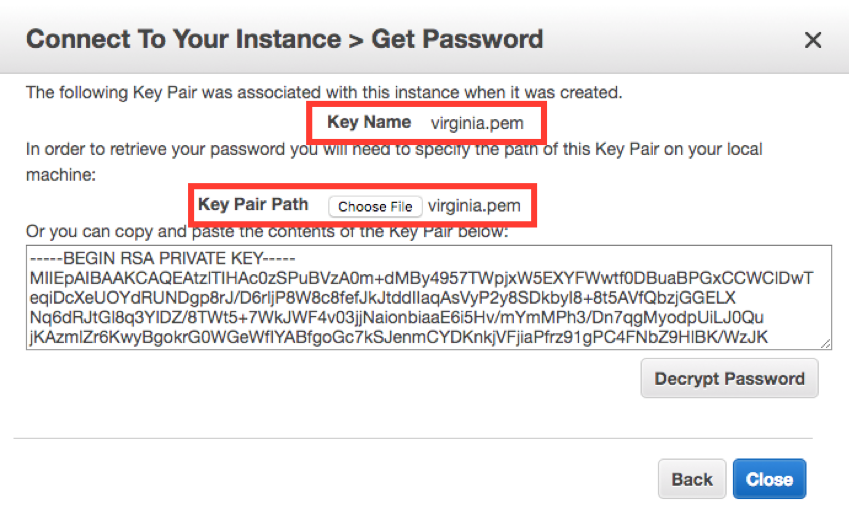
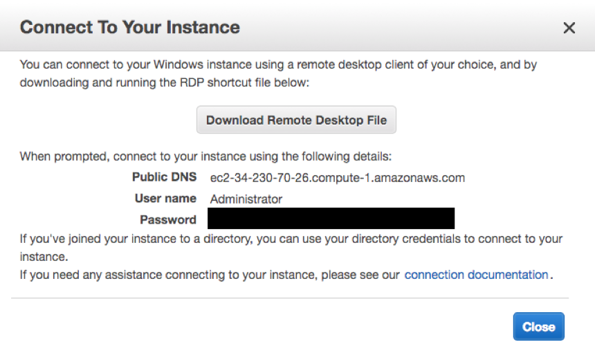
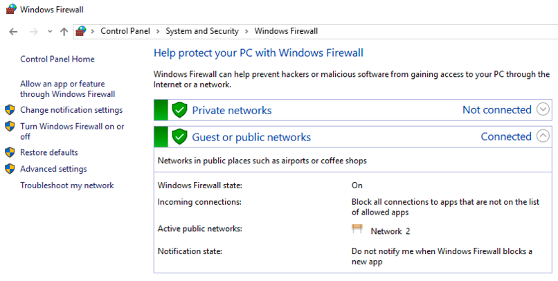
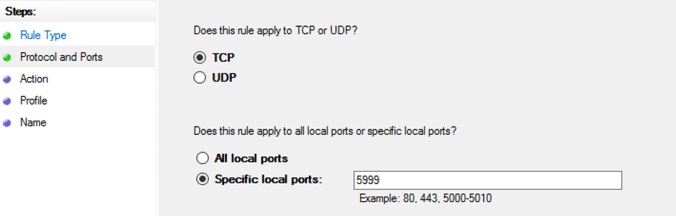
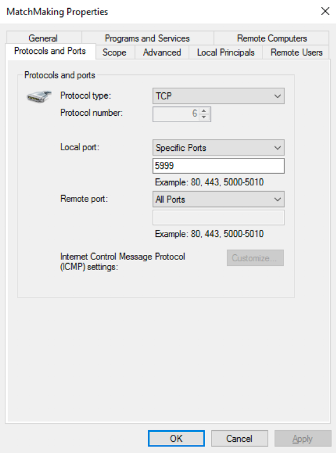

## Appendix D - Setting up the EC2 Matchmaking Server

Creating and setting the EC2 Windows Server
1.	Select EC2 Service in the console and click the Launch Instance button to start EC2 creation.
2.	Select Microsoft Windows Server 2016 Base as Amazon Machine Image.
 

3.	Select t2.large or lager instance type.
4.	Set the security group as follows.

 
5.	If you have a key pair (.pem file), you can use it. If not, select the Create a new key pair option, and create and download a new key pair. As the generated key pair is used for the password decryption of the instance, you should use a key pair without a designated password. 
6.	It takes about 4 minutes for Windows Server to be accessible.
7.	Select the Instances menu of the EC3 service and click the Connect button on the top after selecting the created instance.
8.	By default, the Administrator account will be allocated. Click the Get Password button to get the connection password.
9.	The password is generated using the public key and encrypted.
10.	Select the key that is same with the key pair used to create an instance, as shown below, and click the Decrypt Password button to decrypt the password.

 
11.	Then, the instance connection information will be displayed on the screen as follows.

12.	Connect the instance remotely using the information on the screen (if you have not assigned the public IP, the public DNS will not be provided. In this case, create an elastic IP and assign it to the instance and then, connect using the assigned EIP).
13.	For connection, the Windows user can use the remote desktop (Run -> Input “mstsc”) and the Mac user can install Microsoft Remote Desktop from App Store.
14.	Set the firewall. Select Control Panel -> System and Security -> Windows Firewall.

 
15.	Select “Advanced settings” on the left-side menu.
16.	Select Inbound Rules on the left menu and click the New Rule… menu on the right. New Inbound Rule Wizard will start.
17.	Select Port as Rule Type and click Next. Input 5999 in Specific local ports and click Next.

 
18.	Then, select default values after this. Lastly, input the policy name and click Finish to complete firewall setting.
 

 

19.	Return to the previous exercise and complete Matchmaker server configuration.
