## Step 1 Architecture Overview
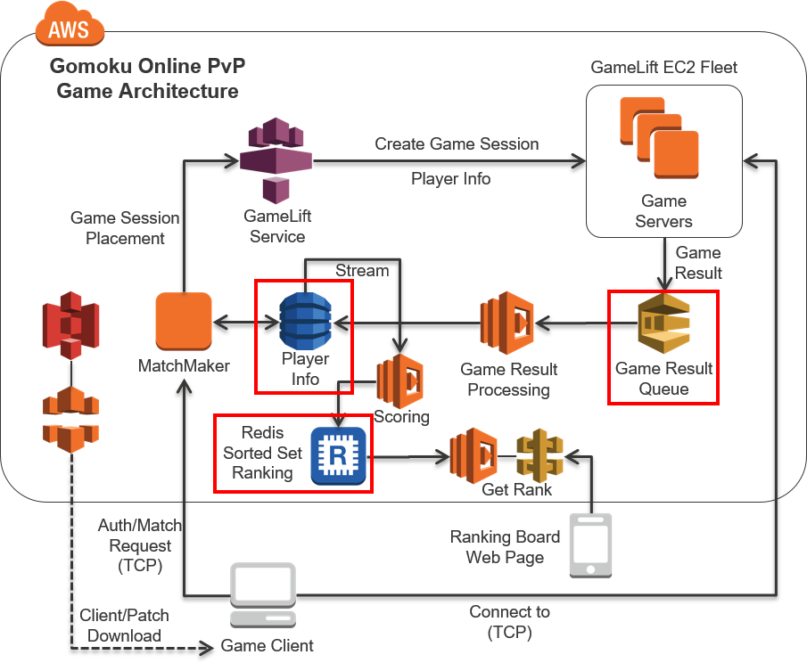

This Lab will be using DynamoDB as the source of all user information and their match results. We will be storing simple information and also will be used as a source of truth for the leader board, which can be access via web. In addition, we will put an ElastiCache on top of DynamoDB to serve the said leaderboard to the public, as we know your app will draw a lot of attention, so we don’t want to hammer the database with same request all the time. 

And all the match results? We will use SQS to queue up all the match results, and insert into the database using lambda, so we can post process the results before inserting into the table. This will also ensure the game flow will not wait on other component to finish, giving the players a better fluid experience. Imagine when you have many players and they all try to send out results to be processed in line. This can cause congestion and in turn lead to bad user experience.
So, we shall begin with creating our DynamoDB table. 
1.	Sign in to AWS Console and head to DynamoDB page at https://console.aws.amazon.com/dynamodb
2.	Identify your region, and take note of it. We want to make sure all service components reside within the same region for this lab.
3.	On the console, click on Create Table icon, to create a new DynamoDB table.
4.	Create a table with name of “GomokuPlayerInfo” and set Primary Key as “PlayerName” with data type of String, then click on Create.

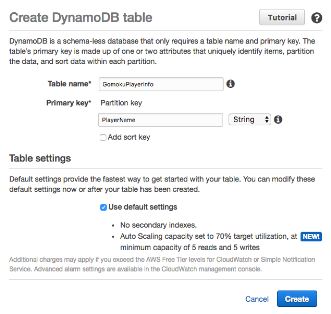
 
5.	Once the table is created, we will create a stream by clicking Manage Stream button. By default, stream is disabled. 

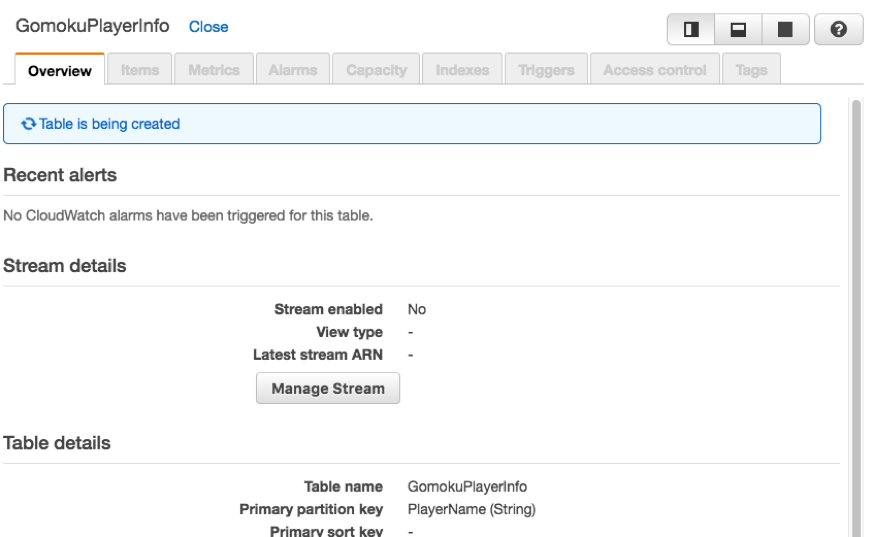
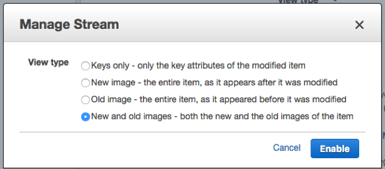

6.	Select New and old images as view type, and click enable.
7.	Now, we have the base complete. Now, let’s create a test data sample. In the table, open the Items tab.

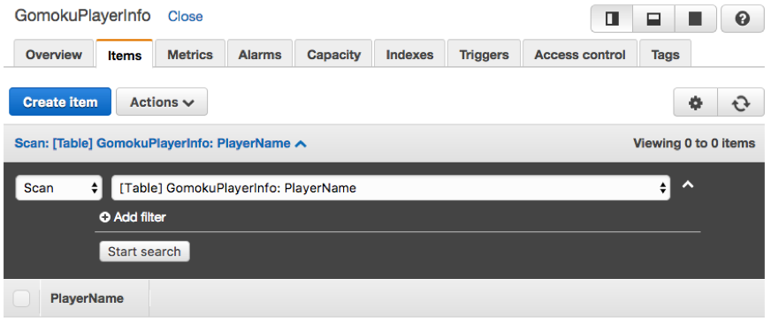

8.	Click Create Item button to create a new DynamoDB row item.
9.	From the Editor, you can click the + button, followed by Append, and the data type. We will repeat to insert something that looks like below.

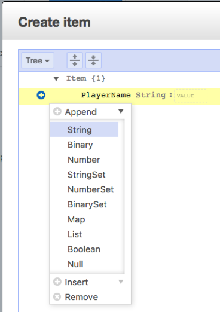

10.	 We will add some data like below, and click Save button to save.

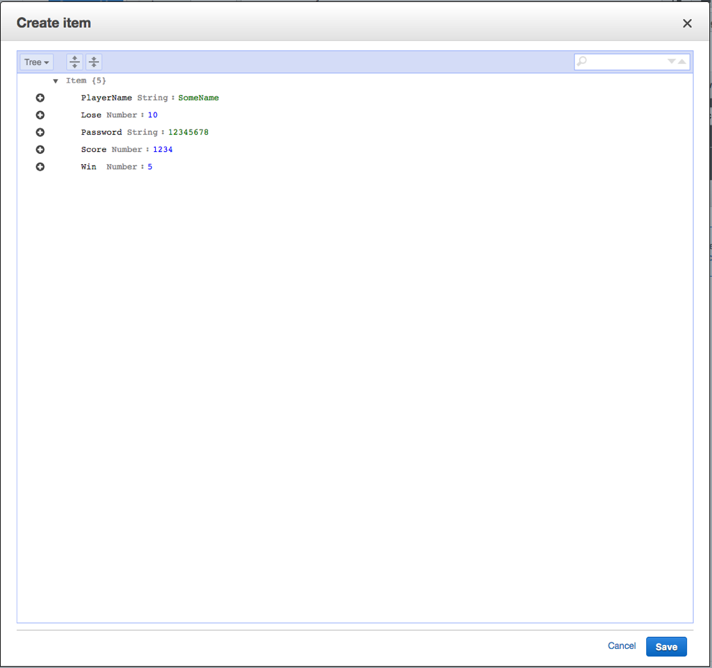

Preparation for DynamoDB is now completed. Now, let’s go for ElastiCache. This will store the ranking information of this stack so we don’t DDB for every query all the time.

1.	Again, from AWS Console, let’s head to https://console.aws.amazon.com/elasticache/
2.	Create a new ElastiCache cluster. We will use Redis engine.
3.	Enter the necessary information as below picture. (We won’t test cluster mode)

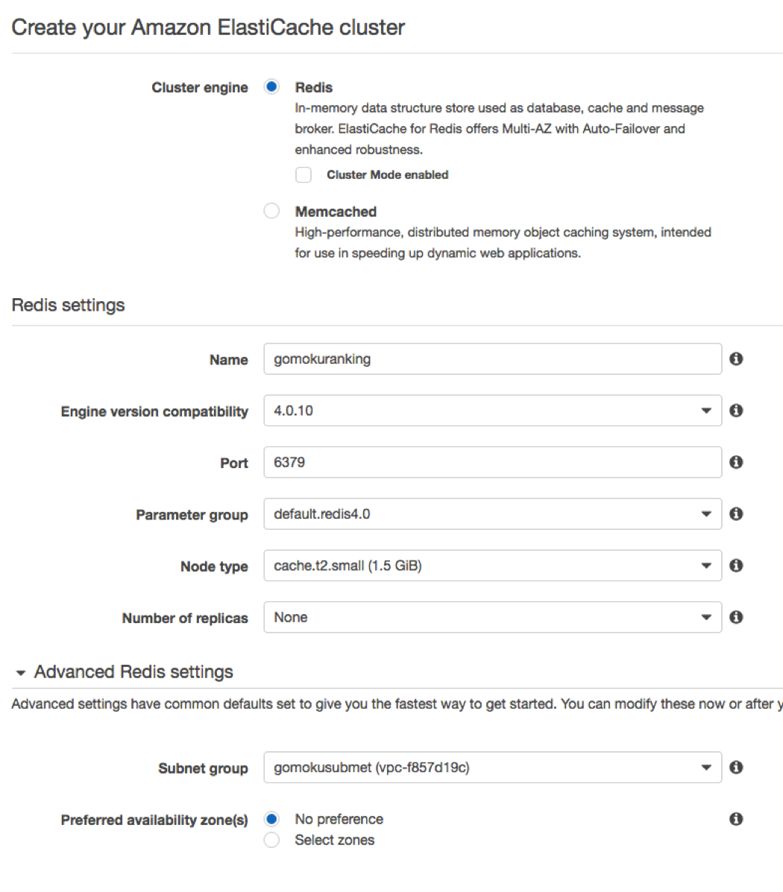

- Name: gomokuranking
- Engine: 4.0.10 (As of 2018 Aug)
- Port: 6379 (default)
- Parameter group: default 
- Node type: t2.small or t2.medium
- Number of replicas: None (If you select None, Description Box will go away)

4.	From Advanced settings, choose the right VPC and create a new subnet group or use existing. 

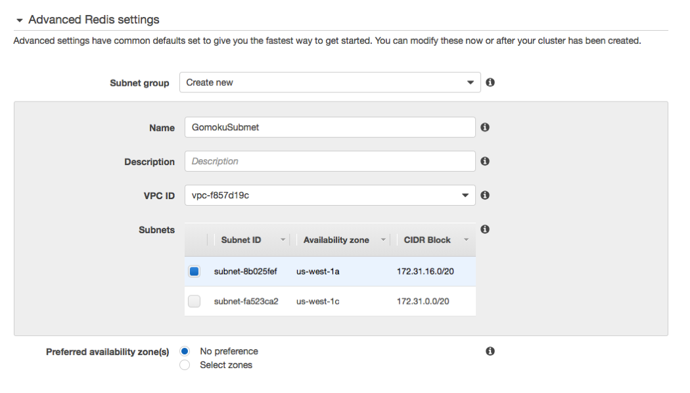

5.	Once all is set, click Create to create your redis cluster. (It will take some time, so you can create SQS at this point and comeback later to finish rest of the step)

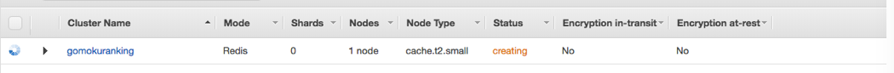

6.	If you want to create on a specific VPC, open Advanced Redis settings page, and enter your VPC information.
7.	When Status changes from creating to available, take note of the Primary Endpoint. We will be using that end point in Lambda function as well.

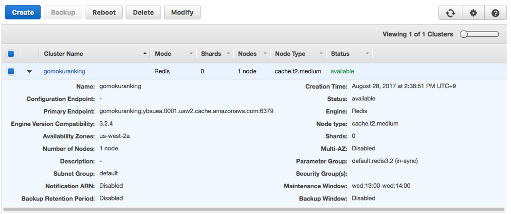

8.	Now, to make sure we have a secure Cache, we want to put our gomokuranking cluster within a safe security group. Since this is a simple lab environment, let’s create a baseline security group and assign to this ElasticCache.
9.	From VPC console (https://console.aws.amazon.com/vpc) open security groups menu from the lower left.
10.	From the page, click on Create Security Group button.

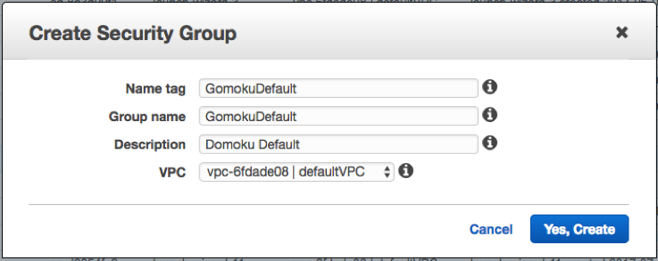

11.	Enter proper Name, Group name and description, and create inside your default VPC.
12.	To allow communication within the security group, select the security group and Edit Inbound Rules.

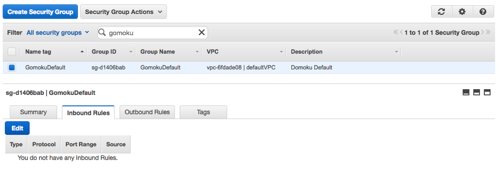

13.	Click Edit button from Inbound Rules tab, and put rules as below. Note you assign the Source as the Security Group itself, meaning every host/ service that has this security group can talk to each other, unrestricted. Take note of the security group created.

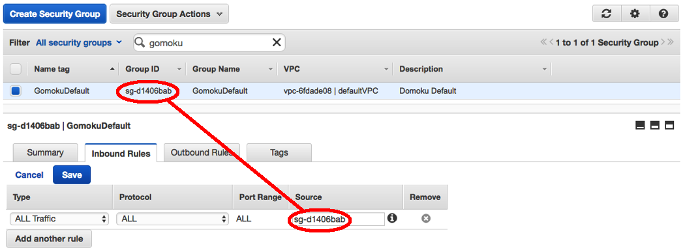

- Type: All traffic
- Protocole: All
- Source: Security Group itself

14.	Once the group is created by clicking the save button, go back to the ElasticCache page, and open the Redis cache cluster just created.
15.	Select the cluster, and click Modify button on top.

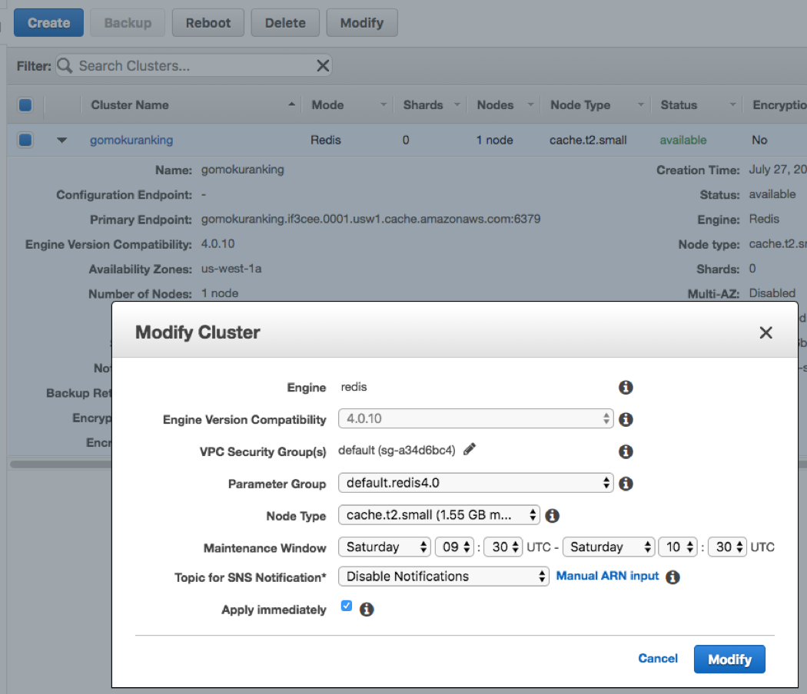
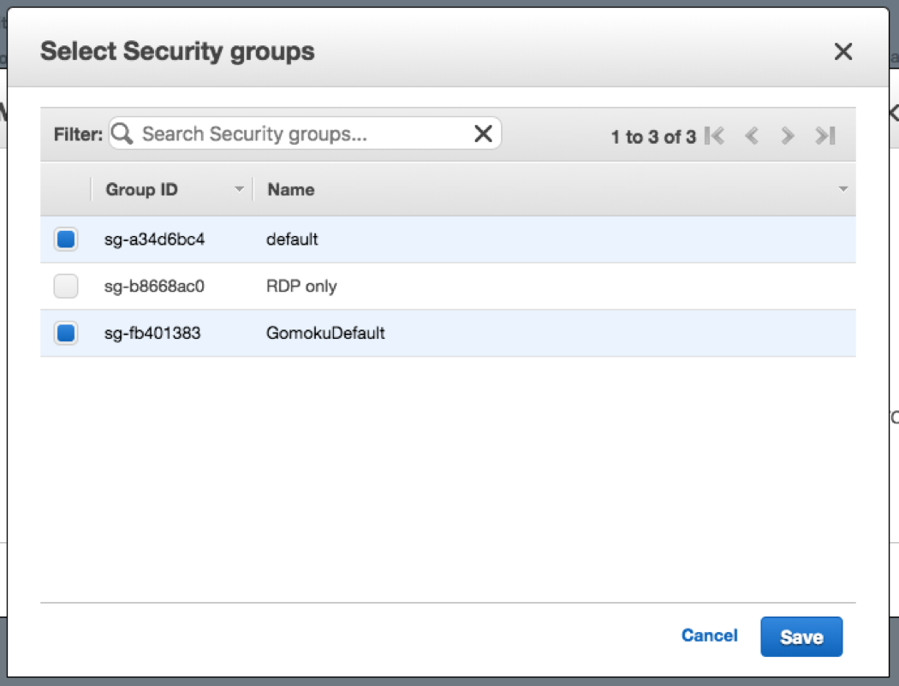

16.	From the pop up menu, click the pencil icon next to VPC Security groups line, select the VPC Security Group you have just created, and click Save, and then Modify to modify the cluster settings. 

Now, since we got the ElastiCache done, we will configure the SQS, which will handle the game result submission queue.

1.	Open console at https://console.aws.amazon.com/sqs
2.	Proceed to create a new queue. Enter the queue’s name as game-result-queue.
3.	We won’t need to adjust the queue configuration from default, so click on to “Create Queue” to finish creating the queue.
4.	When the queue is created, please take note of the queue’s end point URL. We will need to use it in our lambda function.

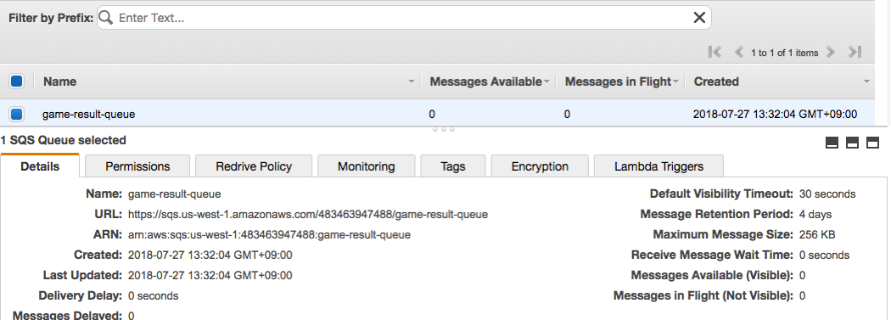

Finally, we will create a handful of IAM roles that we will be using along with our full stack applications.
1.	First, let’s create a few Roles that we will be assigning to our Lambda function later on. To do so, let’s head into the IAM Console. (https://console.aws.amazon.com/iam )
2.	Once in IAM Console, click on the Roles menu, and click Create new role to create a new one.
3.	For role type, select AWS Service Role, and select AWS Lambda as type.

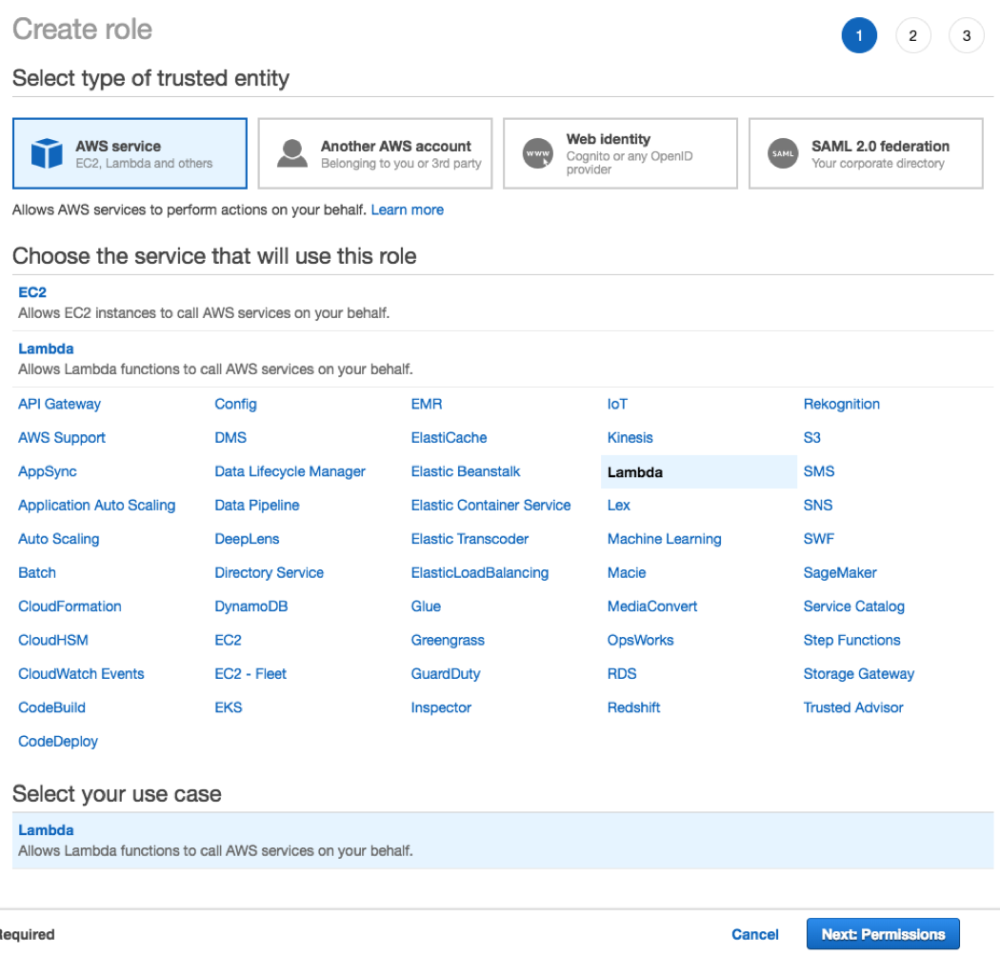

4.	Then, we will attach 2 policies. First is the AmazonSQSFullAccess.

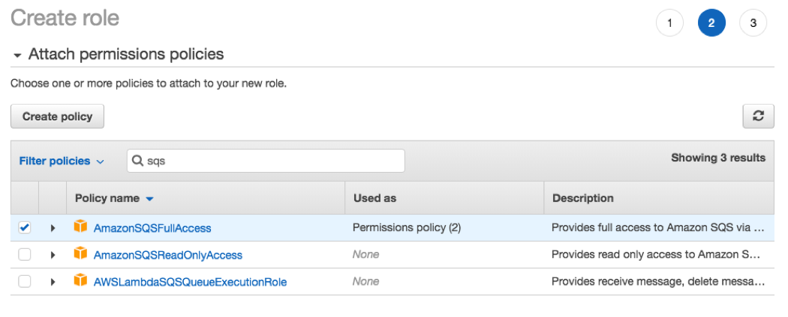

5.	Secondly, we will attach AmazonDynamoDBFullAccess, and click Next: Review button.

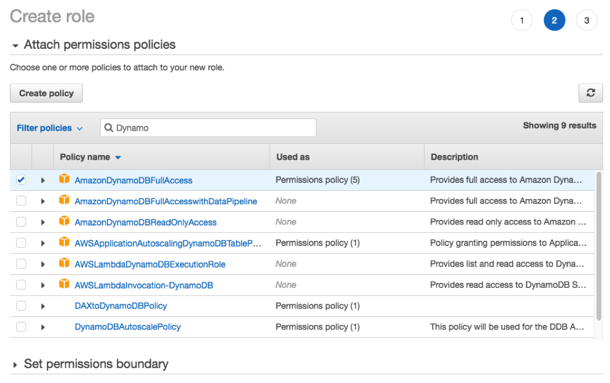

6.	As for the Role name, lets assign Gomok-game-sqs-process.

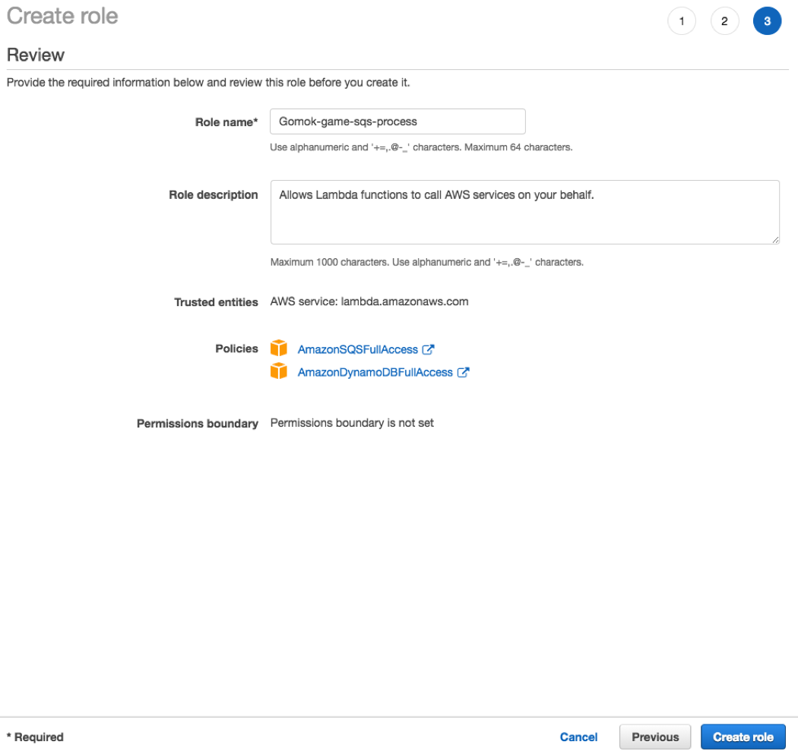

7.	And then, click Create role button to create the first role.
8.	For our second Role, we will follow above instruction the same way. But this time, we will allow for AmazonDynamoDBFullAccess, AmazonVPCFullAccess and AWSLambdaBasicExecutionRole.
9.	This Role, we will name Gomok-game-rank-update.
10.	Third and final, we will repeat above and this time, we will grant full access to VPC via AmazonVPCFullAccess, and also AWSLambdaBasicExecutionRole.
11.	We will call this Gomok-game-rank-reader.
12.	When all is created, it will look like below from Role console.

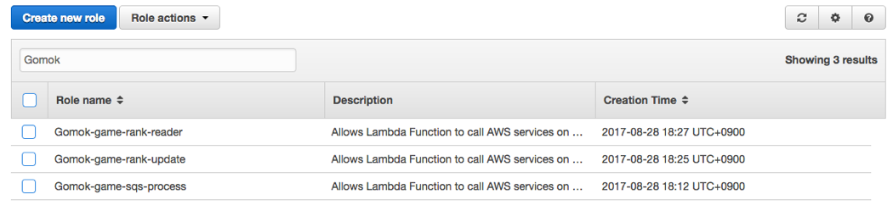

- To proceed to the next step, click [here](../deployment-step-2/deployment-step-2.md)