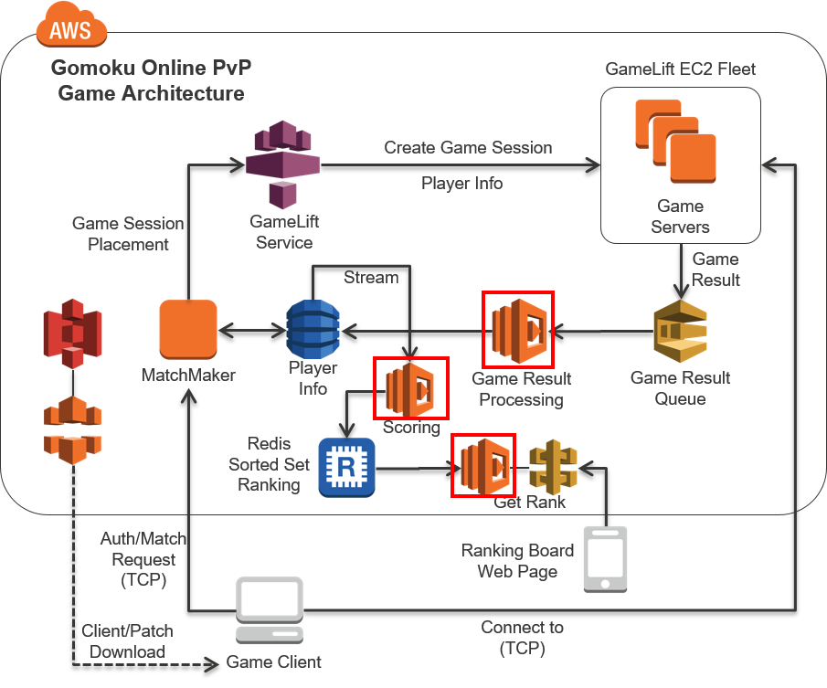
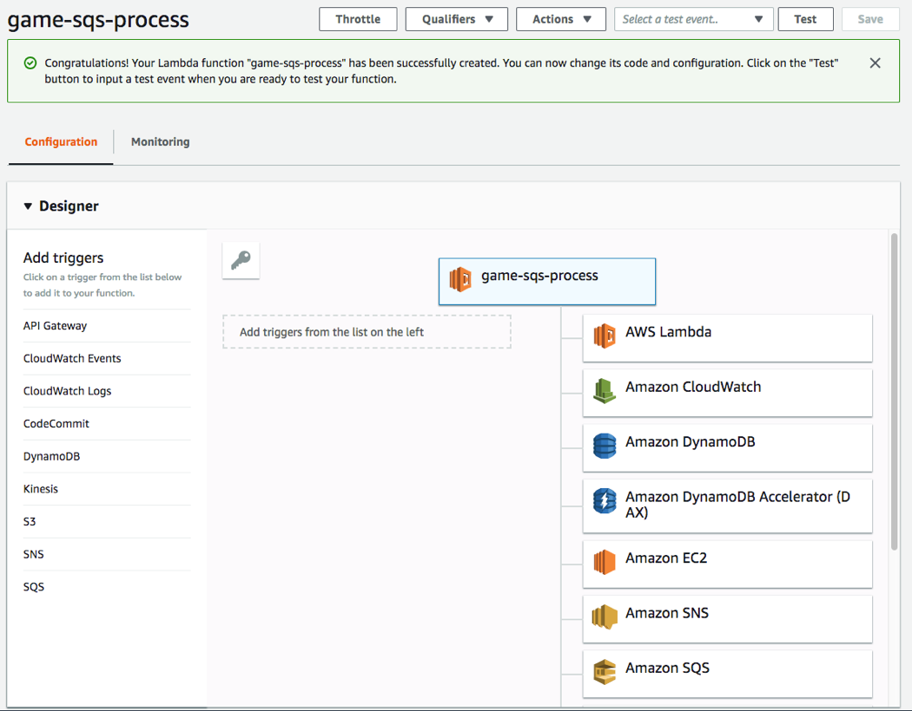
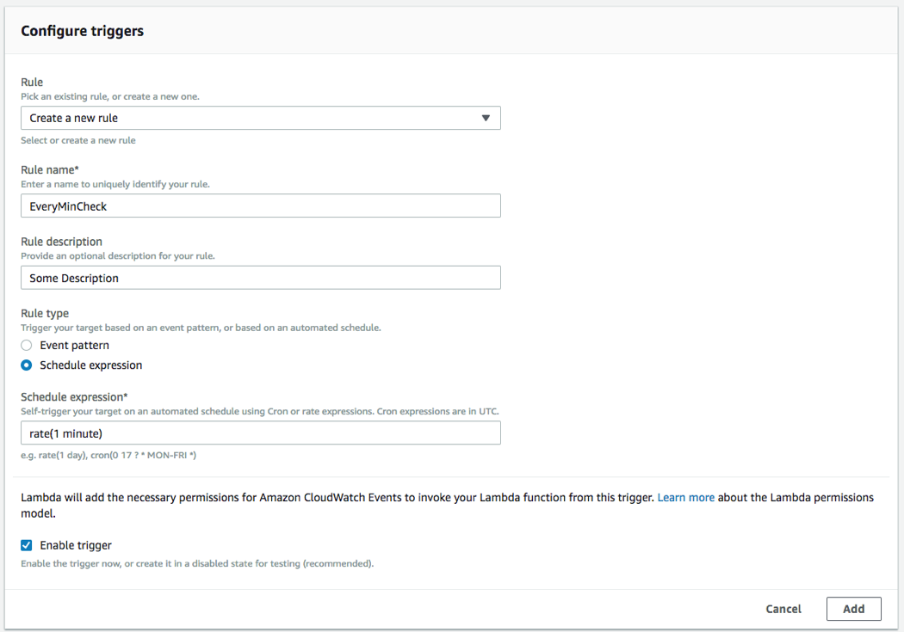
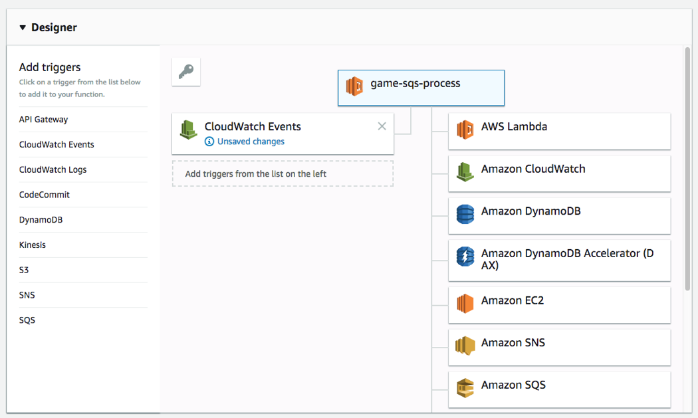
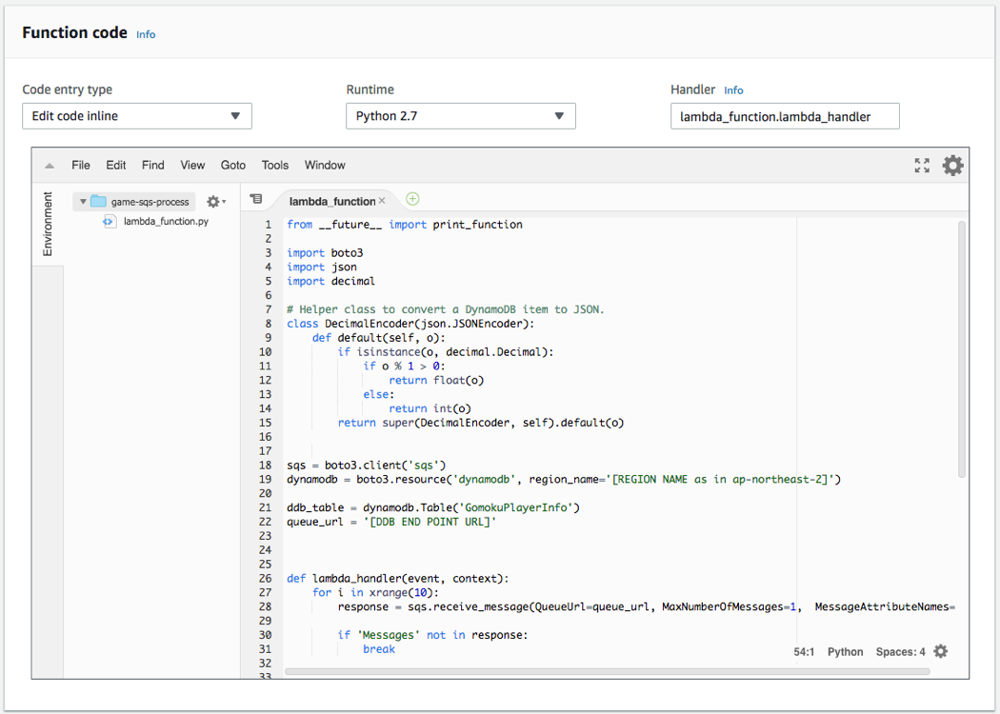
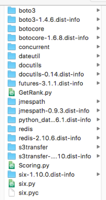
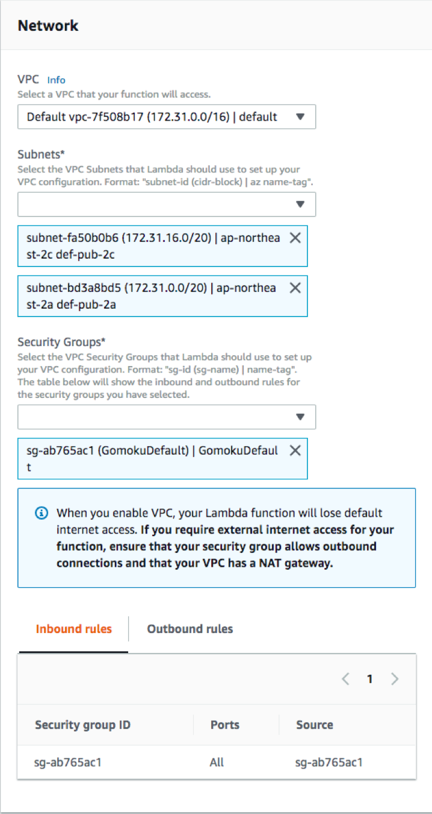
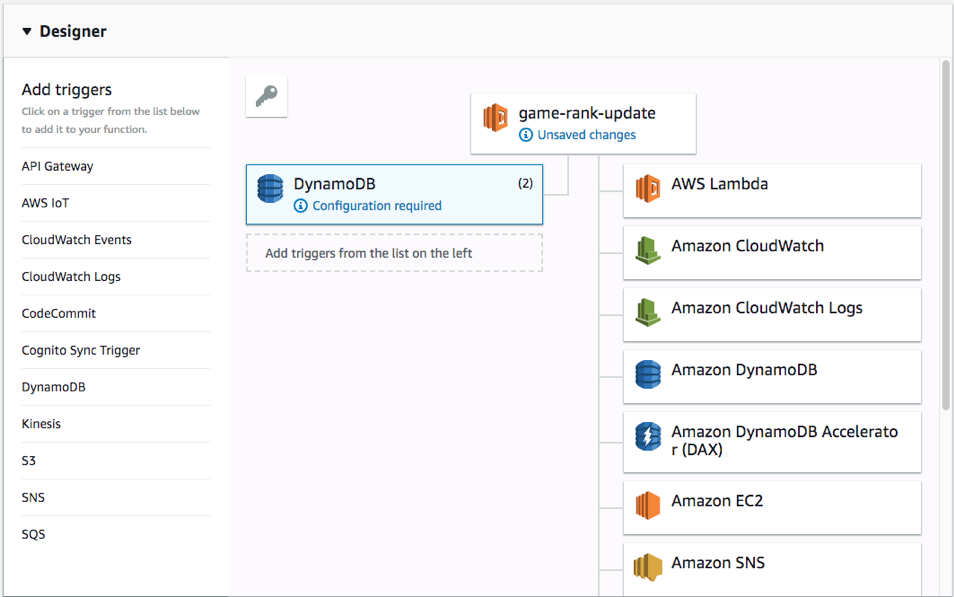
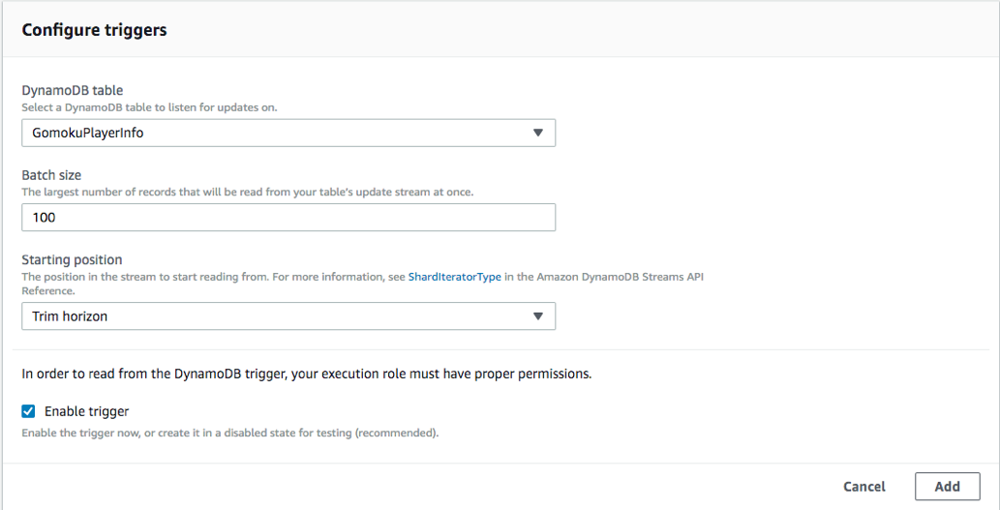
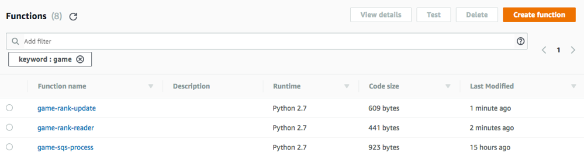

## Step 2 Architecture Overview

In the previous section, we have went through base service for the stack. Now we will be creating bonding lambda service which will deal with user’s activity and processing their result.
In this example, we will deal with 3 different lambda functions. 
1.	Open Lambda console at https://console.aws.amazon.com/lambda
2.	From console, click create function button to start creating our first function.
3.	For our functions, since we know what we are creating, click Author from scratch to create an empty Lambda function.
4.	Input game-sqs-process into the Name field.
5.	Select Python 2.7 as its runtime.
6.	Select Choose an existing role for Role and execute Create function after selecting Gomok-game-sqs-process as the said role.
7.	When the function is successfully created, you will see the Designer pane. From left side select CloudWatch Events as the trigger. 

8.	Lower in the screen, in Configure triggers section, in the Rule drop box, select “Create a new rule”Rule name, use any name you’d like to. For Rule type, choose Scheduled expression, and for the Scheduled expression itself, we want to make this Lambda to run every minute. So we will use rate expression as “rate(1 minute)”

9.	Finally select “Enable trigger” to let Lambda create necessary permissions on CloudWatch so this function can run every minute. Now click Add.
10.	Going back to the Designer pane, click the game-sqs-process icon at top so we can modify the function itself.
 

11.	We will need to fill the function information as: 
 

- Code entry type: Edit code inline
- Runtime: Python 2.7
- Code: (Content of GameResultProcessing.py, replace queue_url and region_name variable to yours. region_name is the region your code is running, i.e) ap-northeast-1, and queue_url is your SQS end point URL as checked on Section 1.)
- Role: Choose an Existing Role	
- Role name: Gomok-game-sqs-process (We created this role from above.)
- Advanced settings: 128MB Memory and 1 min timeout
- queue_url: The endpoint URL of the SQS created above.
- region_name: The code of your region. 
- Handler: lambda_function.lambda_handler

12.	Click Save button to create the function. The created function reads the game result score recorded and updates related information in DynamoDB

For the second lambda, we will create a new Lambda function from scratch. However, unlike the first one, we will create this function using python deployment package. For the first Lambda, it only used the standard python SDK for AWS, so we could do inline edits. However, for the second and third, since we will be using REDIS library, it’d be a great opportunity to create a function via deployment package.

Since we already have all the necessary information to create, we will use the LambdaDeploy.zip for both functions. But before we can use it, we will need to update a few places to update the resources used in the code. 

If you want to recreate yourself from scratch, you can do it by following Appendix A.

1.	Open the zip file, and locate 2 python files, GetRank.py and Scoring.py.
 
 

2.	First, open Scoring.py file, and replace redis host information (Line 6) to your ElastiCache End point address.
3.	Secondly, open GetRank.py file, and replace redis host information (Line 6) to your ElastiCache End point address.
4.	Save both files, and we need to recreate the zip file to upload.
5.	Create the zip file using command such as “zip –r LambdaDeploy.zip *” from the root of the zip. 
6.	We need both of the .py files to be located at the root of the zip file.

Now, we have the deployment zip file in hand, let’s continue with building both lambda functions.

1.	Just like the first function, create a new function from scratch.
2.	Set Name to game-rank-update and Role to Gomok-game-rank-update and then, click Create function.
3.	Select Upload a .ZIP file under the Function Code, instead of Edit code inline, and upload LambdaDeploy.zip.
4.	Input Scoring.handler into the Handler field.
5.	Time out should be set to 1 min, with 128MB like before.
6.	From Network box, choose the same VPC as ElastiCache was created on and all the subnets associated with (usually every subnet). Choose GomokuDefault security group to be associated with.

 
7.	Click Add trigger and select DynamoDB under the Trigger tab.
8.	The GomokuPlayerInfo DynamoDB table will be used as the Trigger table. Use the default value for other fields and select Trim horizon as Starting position. Select the Enable trigger check box and click the Add button.

9.	When the above process is completed, click Save to complete function creation. (If you click Test function in this stage, the function will fail.)

Now, we are left with the 3rd Lambda function. (Function creation will finish, but you may see trigger create error, 

1.	Let’s create our 3rd function from scratch again.
2.	Input game-rank-reader in the Name field and select Gomok-game-rank-reader you’ve created before as Role.
3.	Click Create function and set Runtime to Python 2.7. Then, Upload a .ZIP file as the Code entry type and upload LambdaDeploy.zip. 
4.	Input GetRank.handler into the Handler field.
5.	Set Timeout to 1 min in the Basic settings part.
Select the VPC that has ElastiCache created before in the Network field in the same way as the previous function. Select all subnet fields and set the Security Group to GomokuDefault created before. 
6.	Then, click Save to create a Lambda function.
Now when we save all, we now have 3 lambda functions like you see below
 

 
Now, we have our functions prepared, we need a way to run these functions. For the first 2, they will be invoked through trigger from our SQS and DynamoDB. But the last function has no trigger. How do we run that function, then? Well, we will be using API Gateway, and we will configure is on section 3.

If you have successfully followed up to now, you can test how several elements created in Section 1 and 2 run. To put it briefly, the overall flow is like this. If data is inserted into SQS, the Lambda function created before will be executed periodically and the pertinent SQS data is updated in DynamoDB. For the data entered in the Dynamo DB, the Redis cache is updated as other Lambda function is executed by the DynamoDB stream trigger. 

In short, we cannot check the content of the Redis cache. However, we can check whether the entire flow is normally by entering the test data and using CloudWatch.

1.	Open SQS using the console. https://console.aws.amazon.com/sqs 
2.	Select game-result-queue created before and click the Queue Actions button on top of the screen. 
3.	Select Send Message among displayed menus. 
4.	Input the following JSON into the displayed text box.(It is recommended to input manually, rather than copy & paste, due to special characters).
        { "PlayerName" : "SomeName" , "WinDiff" : 1, "LoseDiff" : 0, "ScoreDiff" : 100 }
5.	Then, click the Send Message button.
6.	Then, switch to the DynamoDB console https://console.aws.amazon.com/dynamodb and open the GomokuPlayerInfo table. You can see under the Items tab that the item corresponding to the entered JSON data has been reflected (if there was an item corresponding to the same PlayerName, Win and Score should have been increased by 1 and 100 respectively).

(Data update can take 1 - 2 minutes because the execution period of the Lambda function created before is 1 minute)
