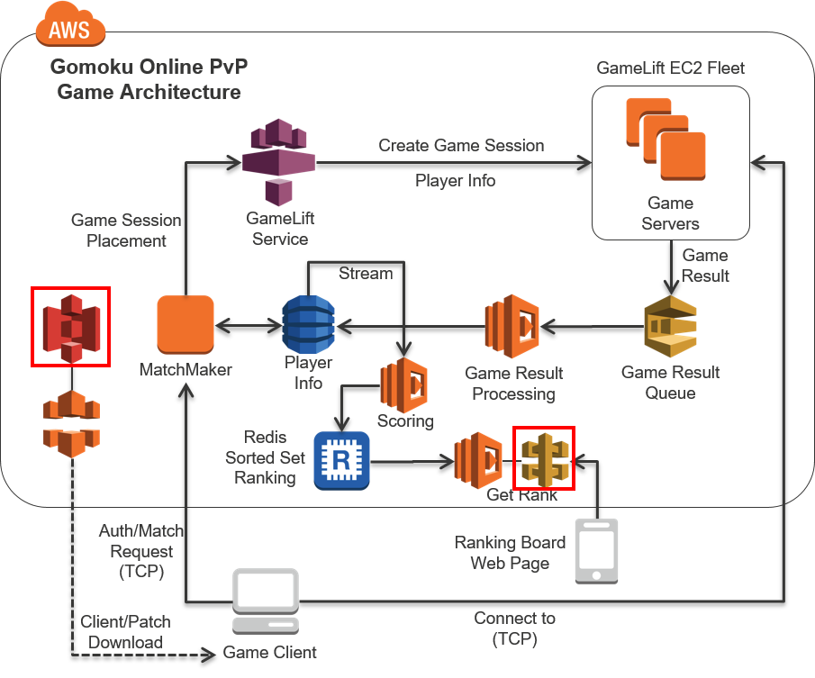
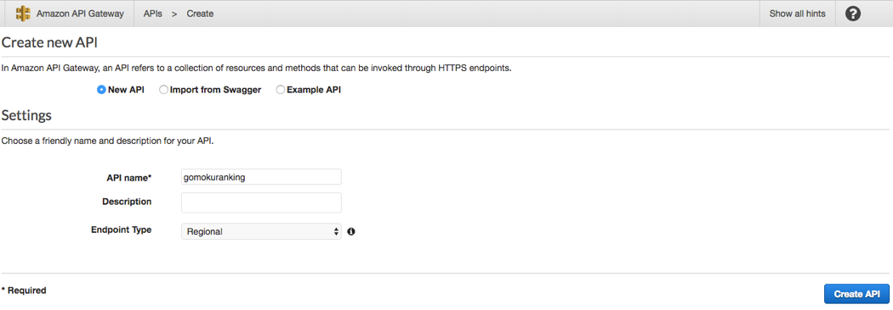
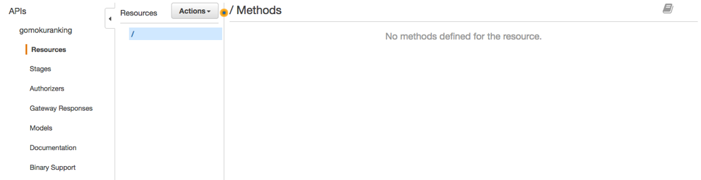
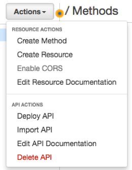
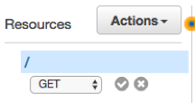
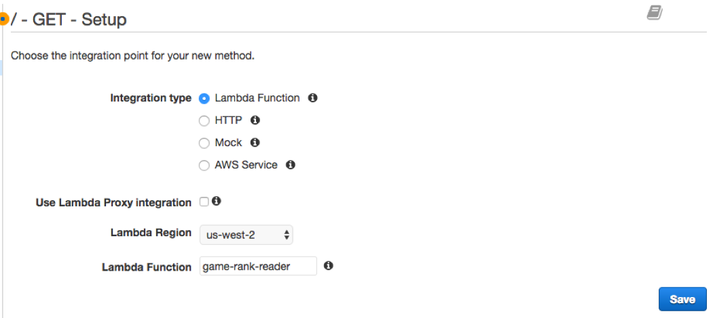
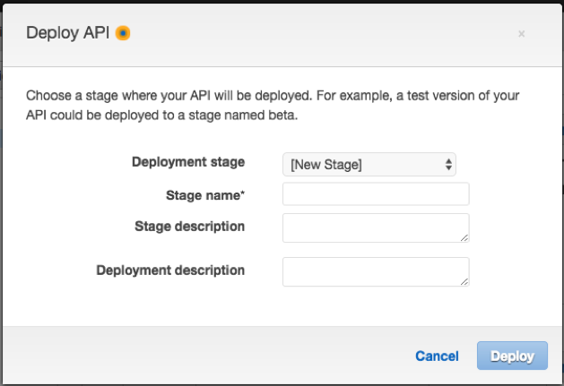
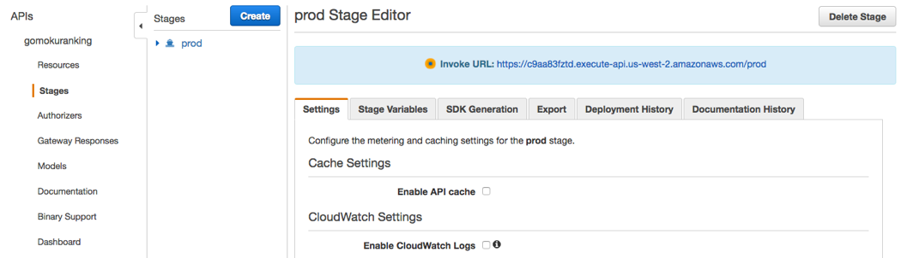
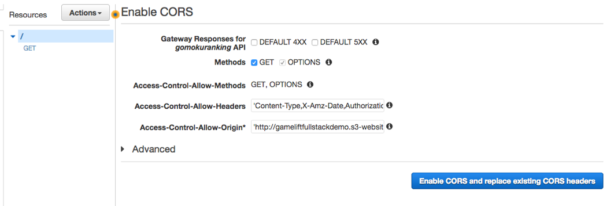
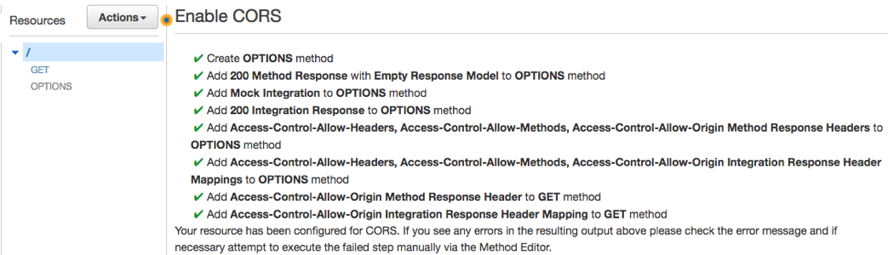

## Step 3 Architecture Overview

For one of the Lambda functions, we know we need to configure a API Gateway. This acts as a “gateway” for your application to run the created Lambda function, hence the name API Gateway.

1.	First, we will need to create a new API Gateway from the console. (https://console.aws.amazon.com/apigateway) 
2.	From the console, click Create API button.
3.	Select New API, enter API name as “gomokuranking” and click Create API.

4.	Once the API is created, you will see an empty screen.
 

5.	First configuration to modify is to create a new method. From the Actions button you see on top of the screen, select Create Method from top of the drop down list.

 
6.	You will see a small list box, and select GET and click on the checkbox.

 

7.	For the GET methos detailed configuration, select Lambda Function as Integration type, and select your Lambda Region, and enter the Lambda function we created – game-rank-reader(name will auto complete as you start typing). Then, select Save.
 

8.	Now we have the API configured, let’s deploy to a new prod stage. From Actions button, select Deploy API. 

 
9.	On Deploy box, select [New Stage] as Deployment stage, and enter “prod” as the Stage name. Then click Deploy.
10.	Once save completes, you will see the Stage setting as below. Take note of the Invoke URL, which we will use from our S3 backed web page.

 

Now, we need to create a S3 backed web site to host the files responsible for the ranking board html and javascripts.

1.	First, create a new S3 bucket that you will use for the web site.
2.	From the lab files archive, you will have found a directory named web. Inside the web directory, there is a file named main.js.
3.	Open main.js in a text editor, and edit the API end point we just created above. (line 48)
4.	Save and close the file, and upload the content of the directory into the bucket.

 
5.	When uploading, make sure they have public read access.

 
6.	As for the bucket, we need to enable Static website hosting.

 
7.	Enable Static website hosting, with index.html as the index document name, and click save.

 
8.	Once the upload is finished, you will be greeted with a simple page when you open the web server end point link as can be seen. However, at the bottom of the screen Score Board section is empty.
9.	Now we have the web site URL, we need to go back to the API Gateway to add a CORS setting to allow this piece of data – ranking board information can be inserted in the web page.
10.	Going back to API Gateway page, from Actions button, click on Enable CORS.
11.	From the CORS page, leave all information as is, but update Access-Control-Allow-Origin to include the static web site URL. (Note trailing / can have an impact, so when not sure, replace it with *, which is the default value)

 
12.	Click Enable button, and continue to replace the existing values on the pop up.
13.	Once it’s all done, you will see a check box and also OPTIONS added on the left side.

 
14.	And lastly, deploy to prod stage via Actions button.
If you open the deployed static page or the invoke URL of the API recorded in step 10 on the web browser, the test data entered in Section 2 will be displayed or displayed as JSON (if the invoke URL is directly opened).

- To proceed to the next step, click [here](../deployment-step-4/deployment-step-4.md)