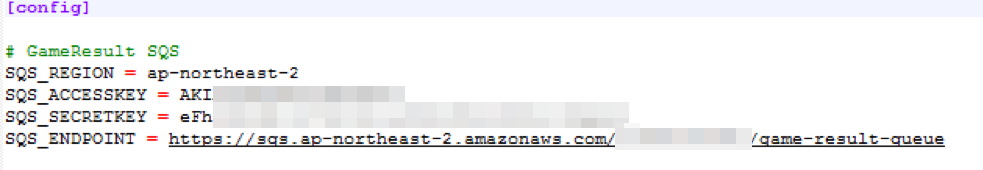

## Step 4 Architecture Overview

This part is getting the Server binary and configuring the Gamelift service to work together. The server binary is precompiled, so there is no need to alter anything. However, if you like to, you can compile and use your binary as the source code is included with the distribution.

1.	First, we will need to create a new IAM user so can be used by the server binary. The user will need SQS access to the queue we created at Section 1.
2.	Open IAM console at https://console.aws.amazon.com/iam and create a new user. We will create a user with Programmatic access only, since this user is to be used by the matchmaking server binary.
 

3.	Head to next page by clicking Next: Permissions button.
4.	In the Permissions page, select to Attach existing policies directly, and choose to allow AmazonSQLFullAccess.

 
5.	Then, click Create user to create a new user.
6.	When the user is created, you will see the AccessKeyID, and associated Secret access key. Take note of the ID and the key. 

 
7.	Download the pair by clicking the download button.
8.	Now, we need to grab the binaries. For this lab, the binaries are all prepared in the binary folder. Note that if you want to compile the binary yourself, please refer to Appendix B.
9.	From the folder, you can see files, GomokuServer.exe, aws-cpp-sdk-*.dll, config.ini, install.bat, aws-cpp-sdk-gamelift-server.dll, vc_redist_x64.exe inside the GomokServer folder.
10.	Using your favorite text editor, edit the config.ini file. File has 4 configuration elements. SQS_REGION is where we put the queue. SQS_ACCESSKEY and SQS_SECRETKEY are account information we made from above. And finally, SQS_ENDPOINT is the end point address for the queue. Save and close the file.

11.	We know you already have AWS cli environment ready. If you don’t take a look at appendix C. Currently, Gamelift will only support CLI upload due to the complex nature of stack upload. 
12.	From the GomokuServer folder, type in the GameLift upload command: aws gamelift upload-build --name "GomokuServer-Build-1" --build-version "1.0.0" --build-root . --region us-west-2
13.	When uploading, make sure you set the region properly. 
14.	In a while, you can see from GameLift console, the build has been uploaded. (https://console.aws.amazon.com/gamelift)

 
15.	From console’s Builds page, select the build we just uploaded, and click Create fleet from build button. This will create our game server fleet.
16.	For the basic information enter as below: (If not mentioned, just leave as default)

- Name: GomokuGameServerFleet-1
- Build: GomokuServer-Build-1 (or your build, if you have multiple of)
- Fleet type: Spot
- Instance Type: C4.large

- Launch path: GomokuServer.exe (or the server binary name if your binary name differs), click on the right green check to confirm.
- Concurrent processes: 50
- Max Concurrent game session activation: 50
 

- EC2 Port Settings: Port range; 49152-6000, Protocol; TCP, IP address range; 0.0.0.0/0

 
And click Initialize fleet and wait.

 
17.	Once creation starts, we will see a screen like this from the Fleets menu.

 
18.	When the creation is finished, the blue box at the left will change into a green Active. (It should take a while until this is finished)
19.	While this is going on, let’s head to Aliases menu and create one.
20.	From the menu, click “Create alias” and assign an Alias Name and a simple Description. (If the description is empty, page does not proceed despite being optional)
21.	For Routing Options, select Simple as Type, and for Associated fleet, click [Select fleet] button to select the fleet we just created. 

 
22.	Fleet state can be Downloading/ Validating/ Activating if not enough time has passed, but should not matter. 

 
23.	As for actually using the Gamelift fleet, we will be using the Alias ID, so take note of Alias ID as seen.

By default, if there is no activity for 240 minutes, fleet will scale down to 0 instance. For the duration of this lab, this should be fine, however, if you want to run this over a long period of time with little traffic, make sure to adjust the auto scale parameters to have at least 1 instance or manually override to have 1 instance always on. (It will take some time if you start up a new server instance from none, so you will need to be flexible from your game client and matchmaking server on handling such cases. This Lab examples do not handle such case, FYI.)

We have configured Gamelift to act as our game server. Now, we will need to create a matchmaking server so our clients can connect and we may direct those players to connect and play a match with each other. Again, we will use the precompiled matchmaker server binary.

1.	Similar to previous step, let’s first edit config.ini file to assign proper resource identifiers.
2.	Again, we have 4 configurable elements. They should be self-explanatory. GAMELIST_ALIAS is the alias identifier we just created. LISTEN_PORT is the port our matchmaking server will listen on. Region identified the region our Gamelift stack is running. PLAYER_TABLENAME is the DynamoDB table name we created at Section 1.

 
3.	Since the matchmaking server needs to run continuously, we will need to create a new EC2 Windows instance to run this server application. First, let’s create an IAM role to give the EC2 instance for easier access privilege management.
4.	From IAM page, head to Roles page, and click Create new role button.
5.	For role type, select AWS Service Role and Amazon EC2 from top.
6.	As for policy, we need to give DynamoDB and GameLift full access. First, attach AmazonDynamoDBFullAccess and click Next Step.
7.	Role name, give any role name you can identify later, and click Create.
8.	Now, from the roles page, click on the GomokuMatchMaker role to add additional policy for gamelift.
 

9.	We can see AmazonDynamoDBFullAccess already attached. So to add Gamelift policy, open Inline Policies section and click the link to create a new policy.
 

10.	To set a new policy you can use a policy generator or enter yourself. Here, we will use the policy generator.
 

11.	From top to bottom, select Allow for effect, and Amazon GameLift for AWS Service. Regarding Actions, select All Actions, and Amazon resource Name, leave as *.
 

12.	Click Add Statement, and click Next Step on the bottom.
13.	The generated policy will look like below:

 
14.	Then, click Apply Policy at the bottom. Your summary page will look something like below, and we have just finished creating a new IAM role for the matchmaking server.

 
15.	Continuing on, we will now create a small EC2 instance using Microsoft Windows Server 2016 Base image. Select an instance type of t2.large or larger.
16.	Assign a security group with port 5999 open to 0.0.0.0/0 in addition to RDP port, so our game client can talk directly to. When finished, it will look similar to below.
 

17.	Login to the instance via RDP and open the firewall settings from control panel. Set up to allow inbound traffic for TCP on port 5999 from everywhere.
18.	While you are logged in, copy the content of binaries\matchmaker (or binaries/matchmaker for those not in Windows land) in to the matchmaker server. (3 .dll files, 1 .ini file, and 2 .exe files)
19.	From the match maker server, run the vc_redist.x64.exe to install the runtime required for the matchmaker server.
20.	Double check the config.ini and make sure it is pointing to the correct GameLift alias as well as other resources.
21.	Start the GomokuMatchMaker.exe and we are just a click away from getting the full stack up and running.

- To proceed to the next step, click [here](../deployment-step-5/deployment-step-5.md)