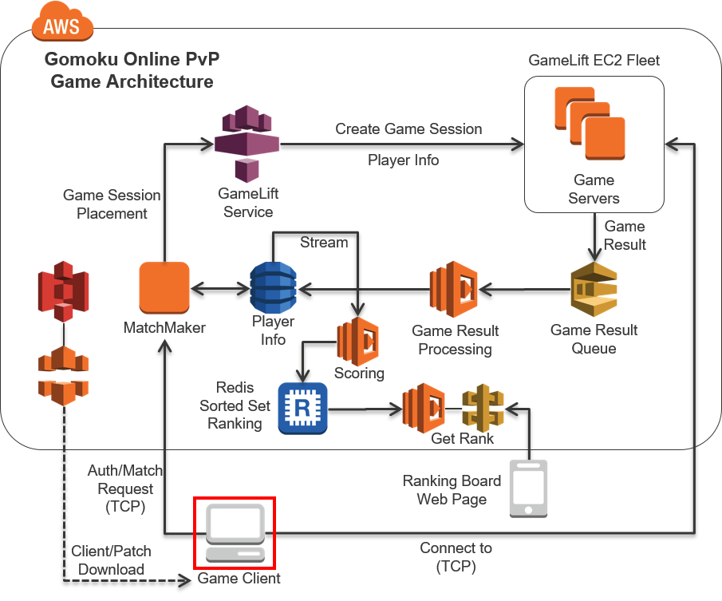

## Step 5 - Playing a Matchmade Game

The game client you are about to open to the world, is by design cross platform. So you can run on your Windows PC or your Mac PC. Mac version, however will need to have Xquartz enabled to run. Also the game client uses TCP port 5999 for outbound. Please adjust your firewall accordingly if necessary.

1.	From the resources you have downloaded, find the folder containing your platform’s game client. (binaries/client)
2.	Edit the config.ini file found with the game client binary. (Open with your favorite text editor)
3.	Update your SERVER_IP section with the EIP created on Section 4.
4.	Update your PLAYER_NAME and PLAYER_PASSWD
5.	Run your game client. It will load and run like a snap.
6.	Right click on the board and click Start.
7.	Wait until someone else would also join the same server, and matchmaking server would pick and start a match. (Or make another copy and use another config.ini to act as a different user)
8.	If you think you have no hope, right click and select Give up to throw the stone.
9.	Enjoy!
